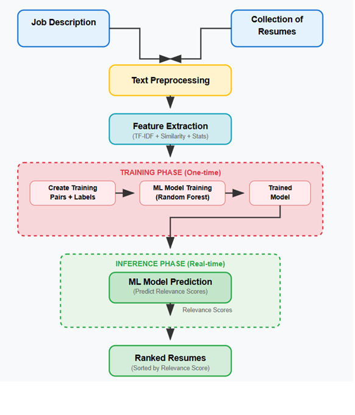

# 📄 Resume Ranking System using ML & NLP

An intelligent resume ranking system that compares job descriptions with candidate resumes using NLP techniques and machine learning. Built with Streamlit for an interactive web interface.

---

## 🚀 Features

- Upload a job description and rank multiple resumes
- Text preprocessing with NLTK (lemmatization, stopword removal)
- Feature extraction using TF-IDF
- Resume scoring with a trained Random Forest Regressor
- Interactive UI using Streamlit

---

## 🧠 Tech Stack

- Python, NLTK, Scikit-learn, Pandas
- TF-IDF Vectorizer, Cosine Similarity
- Random Forest Regressor
- Streamlit (Web Interface)

---

## 📐 Architecture Diagram

